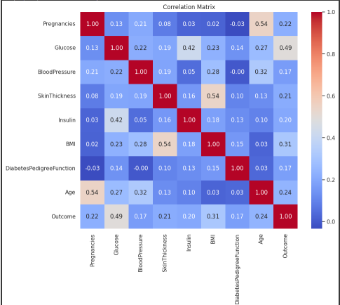
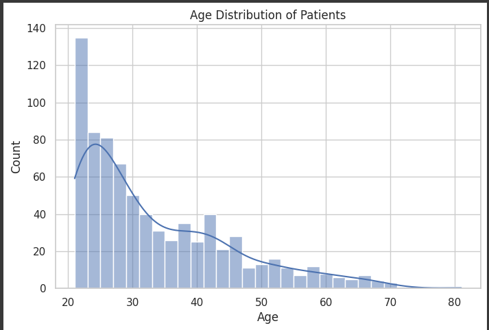
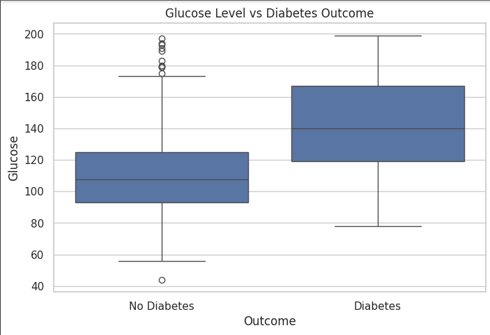

# 🩺 Diabetes Exploratory Data Analysis (EDA)

## 📌 Project Overview
This project performs **exploratory data analysis (EDA)** on a diabetes dataset to uncover hidden patterns, visualize trends, and extract meaningful insights that may support **medical research and predictive modeling**.  

The notebook covers:  
- 🧹 Data cleaning & preprocessing  
- 📊 Statistical & feature analysis  
- 🔗 Correlation studies  
- 📈 Visualizations (distributions, pairplots, heatmaps, etc.)  
- 💡 Key insights and observations  

The ultimate goal is to understand the dataset better and highlight patterns that could guide **healthcare decision-making**.  

---

## 📊 Objectives
- Analyze the distribution of medical features (glucose levels, BMI, etc.).  
- Identify correlations between health indicators.  
- Detect and handle outliers.  
- Summarize patterns relevant to diabetes prediction models.  

---

## 🛠️ Technologies Used
- **Python** 🐍  
- **Pandas & NumPy** – Data manipulation  
- **Matplotlib & Seaborn** – Data visualization  
- **Jupyter Notebook** – Interactive exploration  

---

## 🔍 Key Insights
1. Certain features (e.g., glucose levels, BMI) strongly correlate with diabetes outcomes.  
2. Outliers significantly affect statistical summaries and visualizations.  
3. Not all features contribute equally — some have limited predictive power.  
4. Correlation heatmaps highlight relationships between medical features.  

---

## 📂 Project Structure
```
├── Diabetes_EDA_Project.ipynb   # Main analysis notebook
├── data/                        # (Optional) Dataset directory
├── images/                      # Generated plots & figures
├── requirements.txt             # List of dependencies
└── README.md                    # Project documentation
```

---

## 📦 Requirements
- Python 3.8+  
- pandas  
- numpy  
- matplotlib  
- seaborn  
- jupyter  

Install dependencies with:  
```bash
pip install -r requirements.txt
```

---

## 🚀 How to Run
1. Clone the repository:
   ```bash
   git clone https://github.com/your-username/diabetes-eda-project.git
   cd diabetes-eda-project
   ```
2. (Optional) Create and activate a virtual environment:
   ```bash
   python -m venv venv
   source venv/bin/activate   # Mac/Linux
   venv\Scripts\activate      # Windows
   ```
3. Install dependencies:
   ```bash
   pip install -r requirements.txt
   ```
4. Run the notebook:
   ```bash
   jupyter notebook Diabetes_EDA_Project.ipynb
   ```

---

## 📊 Example Visualizations
Some highlights from the analysis include:  

### Correlation Heatmap  
  

### Age Distribution  
  

### Glucose vs. Diabetes Outcome  
 

---

## 💡 Future Improvements
- Develop predictive models (Logistic Regression, Random Forest, etc.).  
- Add interactive dashboards (Plotly/Streamlit).  
- Automate preprocessing pipelines for new datasets.  

---

## ✨ Author
**Syed Azib Waseem** – Aspiring Data Scientist  
🔗 [LinkedIn](https://www.linkedin.com/in/syed-azib-waseem-815a01281) | [GitHub](https://github.com/SyedAzib)  
